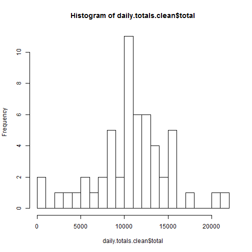

## Loading and preprocessing the data

The data file is loaded using the read.csv function,


```r
act.data.raw <- read.csv("data/activity.csv")
summary(act.data.raw)
```

```
##      steps                date          interval     
##  Min.   :  0.00   2012-10-01:  288   Min.   :   0.0  
##  1st Qu.:  0.00   2012-10-02:  288   1st Qu.: 588.8  
##  Median :  0.00   2012-10-03:  288   Median :1177.5  
##  Mean   : 37.38   2012-10-04:  288   Mean   :1177.5  
##  3rd Qu.: 12.00   2012-10-05:  288   3rd Qu.:1766.2  
##  Max.   :806.00   2012-10-06:  288   Max.   :2355.0  
##  NA's   :2304     (Other)   :15840
```

## What is mean total number of steps taken per day?

Below the daily total steps per day is calculated,


```r
daily.totals <- data.frame( date = as.Date(act.data.raw$date, format = "%Y-%m-%d"), steps = act.data.raw$steps )
daily.totals <- daily.totals %>% group_by(date) %>% summarize(total = sum(steps)) 
hist(daily.totals$total, breaks=20)
```

 

```r
total.steps.mean <- mean(daily.totals$total, na.rm = TRUE)
total.steps.median <- median(daily.totals$total, na.rm = TRUE)
```

The mean steps per day is 10766.19 and the median is 10765

## What is the average daily activity pattern?

Below the average steps per 5 minute interval are calculated (any NA values are ignored in the calculation of the average value),


```r
interval <- data.frame( interval = act.data.raw$interval, steps = act.data.raw$steps )
interval <- interval %>% group_by( interval ) %>% summarize( avgsteps = mean(steps, na.rm = TRUE))

plot( interval, type = "l")
```

 

```r
max.steps <- max( interval$avgsteps )
max.steps.interval <- interval[interval$avgsteps==max.steps,]$interval
```

The maximum average steps per 5 minute interval is 206.1698113 and this occurs in interval 835.

## Imputing missing values

### Number of missing observations


```r
    missing.values <- sum(!(complete.cases(act.data.raw)))
    missing.values
```

```
## [1] 2304
```
Out of a total of 17568 observations there are 2304 rows which contain missing values.

### Substituted values for mission observations

Below is the code to create a new data set with estimates included for all NA values.

The avaeage value for the interval is substituted for the missing value.


```r
act.data.clean <- act.data.raw
act.data.clean$adjustedsteps <- act.data.raw$steps
act.data.clean$adjustedsteps[!complete.cases(act.data.raw)] <- interval[ 
    interval$interval == act.data.raw[which(!complete.cases(act.data.raw)),
    "interval"], ]$avgsteps

daily.totals.clean <- data.frame( date = as.Date(act.data.clean$date, format = "%Y-%m-%d"), steps = act.data.clean$adjustedsteps )
daily.totals.clean <- daily.totals.clean %>% group_by(date) %>% summarize(total = sum(steps)) 
hist(daily.totals.clean$total, breaks=20)
```

 

```r
total.steps.clean.mean <- mean(daily.totals.clean$total, na.rm = TRUE)
total.steps.clean.median <- median(daily.totals.clean$total, na.rm = TRUE)
```

After substituting missing values; the mean steps per day is 10766.19 and the median is 10765.59


### Comparision substituted and not

Below are the histogams comparing the raw data including NA values and data with estimated values in place of NAs. The substituted data in this case has little implact on the results.


```r
par(mfrow=c(1,2))
hist(daily.totals$total, breaks=20)
hist(daily.totals.clean$total, breaks=20)
```

 

## Are there differences in activity patterns between weekdays and weekends?

Below the dataset has been split into weekday and weekends,


```r
wd <- function(d) {
    day <- weekdays(d)
    if ( day == "Saturday" || day == "Sunday" ) {
        "weekend"
    } else {
        "weekday"
    }
}

## weekday /weekends
act.data.clean$date <- as.Date(act.data.clean$date, format = "%Y-%m-%d")
act.data.clean$day <- sapply( act.data.clean$date, wd )
#act.data.clean$day1 <- weekdays( act.data.clean$date )
act.data.clean$day <- factor(act.data.clean$day)

act.data.clean.weekday <- act.data.clean[act.data.clean$day=="weekday",]
act.data.clean.weekend <- act.data.clean[act.data.clean$day=="weekend",]

interval.weekday <- data.frame( interval = act.data.clean.weekday$interval, steps = act.data.clean.weekday$steps )
interval.weekday <- interval.weekday %>% group_by( interval ) %>% summarize( avgsteps = mean(steps, na.rm = TRUE))

interval.weekend <- data.frame( interval = act.data.clean.weekend$interval, steps = act.data.clean.weekend$steps )
interval.weekend <- interval.weekend %>% group_by( interval ) %>% summarize( avgsteps = mean(steps, na.rm = TRUE))

par(mfcol=c(2,1))
plot( interval.weekday, type = "l", main="Weekday", col="blue", xaxt="n", xlab="")
plot( interval.weekend, type = "l", main="Weekend", col="blue", xlab="Interval")
```

 

As can be seen there is a significant difference in activity the average activity patern between weekdays and weekends.

We can see that,

+ Weekdays have more sleep, wake earlier and retire earlier
+ Weekdays have a low level of activity with a peak around midday 
+ Weekends wake later in the day
+ Weekends have a higher level of activity through the day and evening
